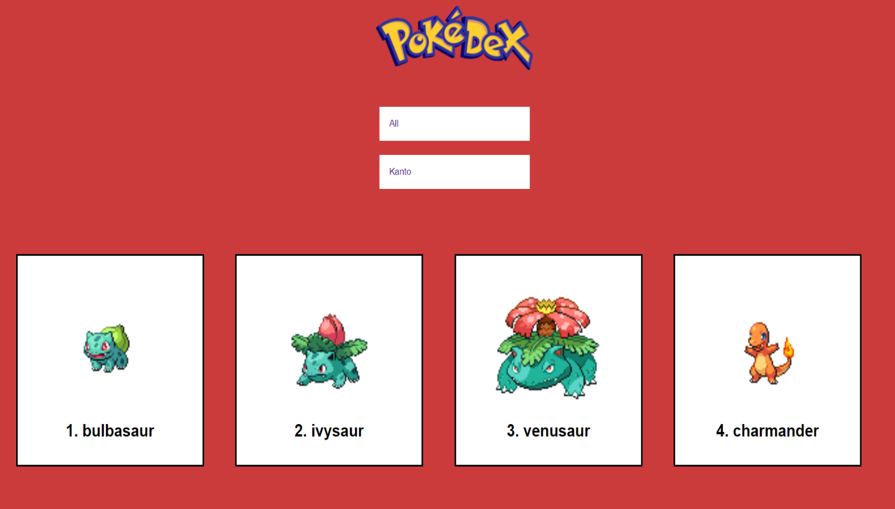

# Pokedex 
> Pokedex is my favorite three generations of Pokemon. Data were collected from API: https://pokeapi.co/

## Table of contents
* [General info](#general-info)
* [Screenshots](#screenshots)
* [Technologies](#technologies)

## General info

Pokémon can be found with two filters. The first serves a type of pokémon such as ground, Eletric, psychics, etc.
The second one depends on generation to choose, Kanto, John, Hoenn
When you click on a given Pokemon, you will display details of the selected Pokemon.

## Screenshots

## Technologies
* JavaScript
* HTML5
* CSS3

